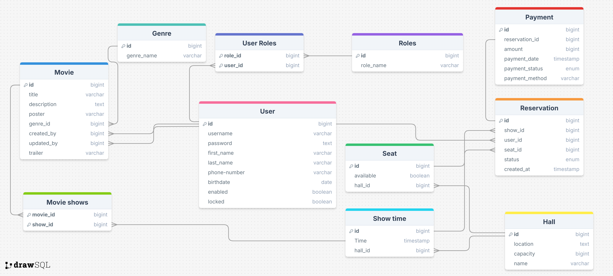

# Movie Reservation API

## Description
A straightforward and efficient RESTful backend built with Spring Boot for managing cinema operations:
- Manage movies and their showtimes
- Reserve seats and process reservations
- Handle user accounts with registration, login, email-based activation, and password reset features  

## Features
- Movies management: create, update, list, and archive movies
- Showtimes: schedule showtimes and list by movie/date
- Seat reservations: reserve/cancel seats with basic availability checks
- Booking flow: create reservations and view user reservation history
- Authentication & authorization: register, login, logout, CSRF protection via cookie, role-based access
- Account lifecycle: email-based account activation and password reset (HTML templates included)
- Persistence & caching: PostgreSQL for data, Redis for sessions/caching
- Mail sandbox: MailDev via Docker Compose for local email testing
- Validation & error handling: request validation with descriptive errors
- Environment-ready: Docker Compose services and sensible dev defaults

## Technology Stack
- Language & Build
  - Java 21
  - Maven 
- Frameworks & Libraries
  - Spring Boot 3.4.5
  - Spring Web (REST)
  - Spring Data JPA, Spring JDBC
  - Spring Validation (Bean Validation)
  - Spring Security 6 (stateless JWT auth, CSRF cookie)
  - Spring OAuth2 Client (Google login)
  - Spring Retry
- Persistence & Caching
  - PostgreSQL (runtime database)
  - Hibernate ORM
  - Redis (sessions/cache) with Spring Data Redis
- Email & Templating
  - Spring Mail (SMTP)
  - Thymeleaf + thymeleaf-extras-springsecurity6 (HTML email templates)
  - MailDev (SMTP server + web UI for local email testing)
- Authentication & Tokens
  - JJWT 0.12.5 (api, impl, jackson)
- Payments
  - PayPal SDKs: paypal-core 1.7.2, rest-api-sdk 1.14.0
- Dev & Tooling
  - Docker & Docker Compose
  - Spring Boot DevTools
  - Lombok

## Database Design
<p align="center">
  
</p>

## Installation

Prerequisites:
- JDK 21 
- Docker Desktop (with Docker Compose)
Quick start (Windows PowerShell):
1) Clone the repository
```powershell
git clone https://github.com/your-org/movie-reservation-api.git
cd "movie-reservation-api"
```

2) Start infrastructure services (PostgreSQL, Redis, MailDev)
```powershell
docker compose up -d
```
    - Services and ports:
        - PostgreSQL: localhost:5432 (DB=movie_reservation, user=postgres, password=password)
        - Redis: localhost:6379
        - MailDev (web UI): http://localhost:3080, SMTP: 1025

3) Run the application
    - Uses Spring profile: dev (configured in src\main\resources\application.properties)
    - Context path: /api/v1 (so URLs start with http://localhost:8080/api/v1)
    - Start with Maven Wrapper:
```powershell
.\mvnw.cmd spring-boot:run
```

4) Verify it’s running
    - Open: http://localhost:8080/api/v1/showTime/all (public endpoint)
    - Check MailDev UI: http://localhost:3080 (emails sent from the app appear here)

Configuration notes:
- Default dev configuration lives in src\main\resources\application-dev.properties and already points to the Docker services above.
- Database schema is managed by Hibernate (spring.jpa.hibernate.ddl-auto=update) in dev mode.
- If you change DB credentials or ports, update application-dev.properties accordingly.

Common commands:
```powershell
# Stop services
docker compose down

# Rebuild and run once
.\mvnw.cmd clean spring-boot:run
``` 
